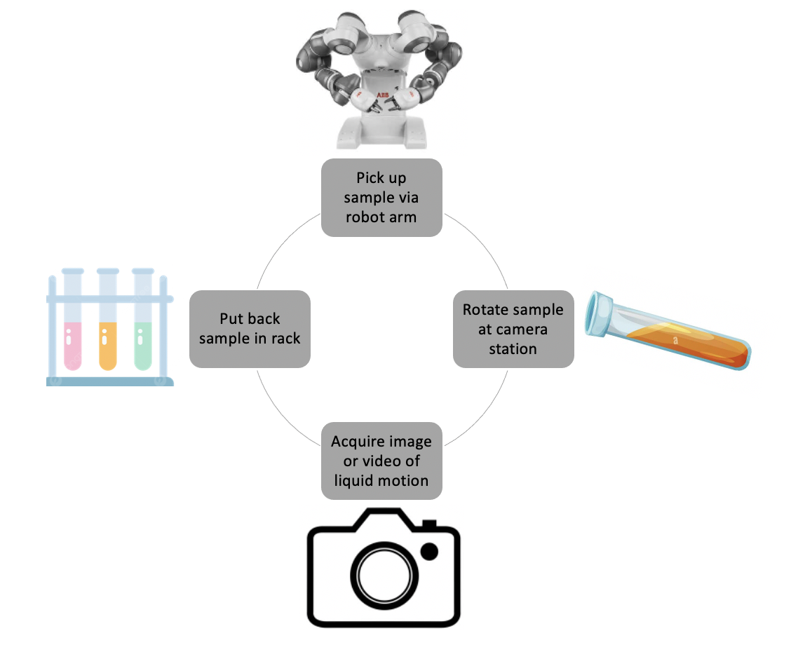

# Machine learning tools for autonomous chemistry laboratories

## Overview - Automated chemistry labs need techniques to measure material properties that are fast, non-invasive and adaptable to robotic environments. Using computer vision, we can estimate the properties of liquids by tracking fluid motion under dynamic conditions (manipulation via robot arm). 

## Description of projects:

## 1 - Autonomous data collection

Training the Convolutional Neural Network (CNN) requires a large dataset of videos consisting of moving liquids with different physical properties. We built an autonomous workflow to manipulate samples, capture the motion and store into our dataset for training later.

